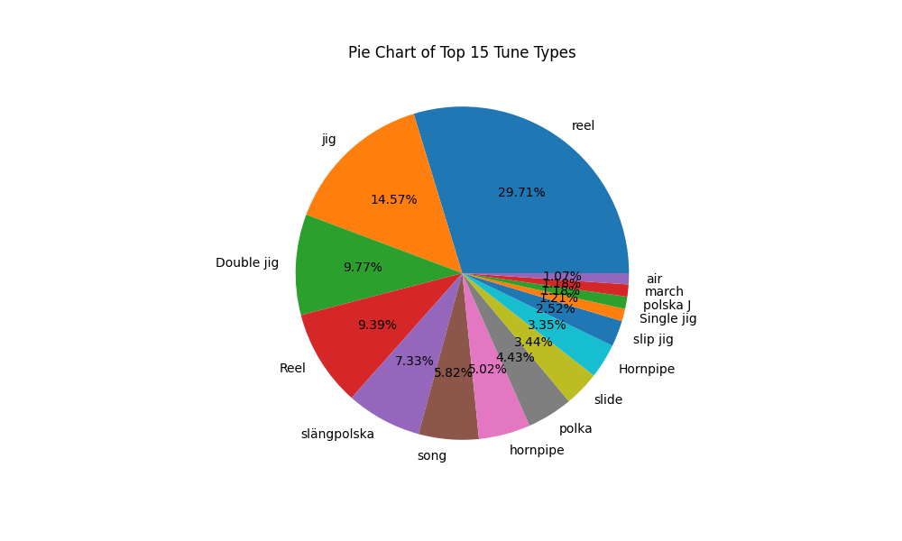

# Assignment 1: Tunes Database Analysis and GUI

---

## Module Information

- **Module:** Data Centric Programming DATA2005  
- **Course:** TU850/2 – Data Science & AI  
- **Lecturer:** Bryan Duggan  
- **Name:** Amy Webb  
- **Student Number:** C24423456

---

## Description of the Project

My project goes through the tunes in files which are in folders and puts them into a MySQL database that then does graphs and search bars on it.

---

## Instructions for Use

Put a folder of abc files into the abc_books folder. Then run the code and press the buttons on the menu to see other windows with things such as search bars and graphs.

---

## How It Works

### Connection and Setup

I established a connection with MySQL database at the start of each following function the connection function is called within it. I created a function that creates a table if it does not exist with columns matching the tunes attributes.

### Data Processing

The program includes an encoding fix function that cleans up character encoding issues in the source files. The process function parses abc files to identify where the tun starts (X:) and extracts each tune's data into a dictionary. It continues this process for all files creating a list of dictionaries while cleaning strings, so there are no blanks. Once this is done, the insert function inserts all the tune data into the MySQL table.

### Interactive Features

I developed a user interface with different sized windows, labeled columns, and scrollbars for accessibility. The interface has 3 main functions. 

**Displays all Tunes:** Retrieves and displays every tune from the database in a formatted table. 

**Search by Title:** The search query does not have to be exactly correct as it is a partial search. It uses the same method of all tunes function to get all the tunes in the table that match the condition and the condition is known through the search statement once the click me button is clicked. 

**Search by Book Number:** I developed a function that searches tune by the book number; it is like the search by title but is not a partial search as you can't do that for numeric values.

### Data Visualization

I created two analytical charts using matplotlib and pandas Data Frames:

**Pie Chart:** Visualizes the top 15 tune types by frequency, with percentages formatted to one decimal place for clarity. 

**Bar Chart:** Shows the top 10 origins of tunes with known origins. Since many tunes did not have origin in the database, I filtered the results to ignore empty values by selecting elements 1-11 from the value count. Only getting known origins. Each bar uses a distinct hexadecimal colour for simplicity.

### User Interface

The program features a menu with buttons that trigger the corresponding display and search functions based on what the user clicked.

### File Discovery

The final component traverses the abc books directory structure, identifying numbered folders and cataloging all contained files for processing. This part was given in starter code.

---

## List of Files in the Project

- Abc_books folder from assignment
- Assignment_Code.py modified from starter_code.py
- Assignment.md from assignment
- Image folder from assignment
- barchart.png
- LICENSE from assignment
- .gitignore from assignment
- piechart.png
- README.MD modified from assignment

---

## References

- GeeksforGeeks. (2025, July 11). Python | Menu widget in Tkinter. Retrieved from https://www.geeksforgeeks.org/python/python-menu-widget-in-tkinter/
- GeeksforGeeks. (2025, July 12). Plot a Pie Chart in Python using Matplotlib. Retrieved from https://www.geeksforgeeks.org/data-science/plot-a-pie-chart-in-python-using-matplotlib/
- DataCamp. (2025, April 17). Python Pie Chart: Build and Style with Pandas and Matplotlib. Retrieved from https://www.datacamp.com/tutorial/python-pie-chart
- Stack Overflow. (2023, November 27). Tkinter — Create table using database fetched data. Retrieved from https://stackoverflow.com/questions/77556489/tkinter-create-table-using-database-fetched-data
- Duggan, B. (2025). Lecture notes for DATA2005: Data Centric Programming TU Dublin, School of Computer Science.

---

## What I Am Most Proud of in the Assignment

I am most proud of the data visualization charts I created using matplotlib. This was my first time using this library. I combined analytical data filtering techniques with visual presentation across two chart types to show insight into the tune collection.

### Example:
```python
def barchart_top10_origins():
    conn = connect_db()
    try:
        #gets all the origins and put them into a data frame
        cursor = conn.cursor()
        cursor.execute("SELECT O FROM tunes1;")
        rows = cursor.fetchall()
        df = pd.DataFrame(rows, columns=["O"])
        
        #gets the origins count and gets top 11
        origin_counts = df["O"].value_counts().head(11)
        
        #filters the first element as the origin is unknown
        origin_counts=origin_counts.iloc[1:11]
        print(origin_counts)
        
        #sets colours for chart
        colours= ["#FF0000","#FE5D00", "#FFFF00","#0CF200","#2C8503","#00BBFF","#001AFF","#B700FF","#FF00EE","#F96AC0"]
        
        #Create the horizontal bar chart that has different colours for each column
        plt.figure(figsize=(10, 6))
        origin_counts.sort_values().plot(kind='barh', color=colours, edgecolor='black')
        plt.title("Top 10 Country Origins", fontsize=14, fontweight='bold')
        plt.xlabel("Number of Tunes", fontsize=12)
        plt.ylabel("Origin", fontsize=12)
        plt.grid(axis='x', linestyle='--', alpha=0.5)
        plt.tight_layout()
        plt.savefig("barchart.png")
        plt.show()
    finally:
        conn.close()
```

This piece of code handles encoding errors, filters out irrelevant elements (unknown origins) and uses custom colours to make each origin distinct. The result is a clean chart that shows where the most tunes originate from.


---

## What I Learned

Through this assignment, I learned how to connect Python to a MySQL database and work with SQL queries to store and retrieve data. I discovered how to process abc files and fix encoding issues by using a LOOKUP table. Creating a user interface taught me how to develop functional search tools with buttons and display tables. I learned how to analyse data using pandas parsing and created charts with matplotlib by filtering datasets and presenting the information clearly. This assignment taught me different programming skills such as databases, file processing, user interfaces, and data visualization into one program that makes data easy to find and understand.

---

## Use of AI

I used Ai to help format this document and improve grammar and phrasing.

---

## Screenshots




---